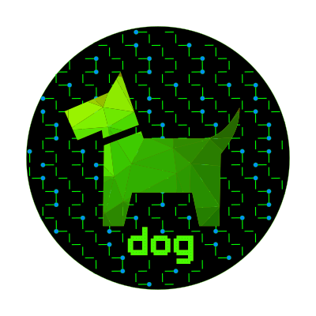

<p align="center">
  
</p>

# dog Terraform Provider (Terraform Plugin Framework)

This provides the ability to manage the dog firewall management system via Terraform.

## Requirements

- [Terraform](https://www.terraform.io/downloads.html) >= 1.3.5
- [Go](https://golang.org/doc/install) >= 1.18
- [dog](https://relaypro-open.github.io/dog/) >= 1.4

## Building The Provider

1. Clone the repository
1. Enter the repository directory
1. Build the provider using the Go `install` command:

```shell
go install
```

## Using the provider

An example provider configuration (set api key value in ENVIRONMENT variable "TF_VAR_dog_api_key_qa"):
main.tf
```
terraform {
  required_providers {
      dog = {
      source = "relaypro-open/dog"
      version = "1.0.10"
  }
}

module "dog" {
  source        = "./dog"
  api_key       = var.dog_api_key_qa
  api_endpoint  = var.dog_api_endpoint
}
```

variables.tf
```
variable "dog_api_key_qa" {
  type = string
  sensitive = true
}

variable "dog_api_endpoint" {
  default = "https://qa-dog.DOMAIN.SOMETHING:8443/api/V2"
}
```

dog/variables.tf
```
variable "api_key" {
  type = string  
  sensitive = true
}

variable "api_endpoint" {
  type = string
  sensitive = true
}
```

dog/main.tf
```
terraform {
  required_providers {
    dog = {
      source = "relaypro-open/dog"
      version = ">=1.0.10"
    }
  }
}

provider "dog" {
  api_endpoint = var.api_endpoint
  api_key = var.api_key
  alias = "qa"
}
```

Example resource records:

dog/group.tf:
```
resource "dog_group" "test_qa" {
  description = ""
  name = "test_qa"
  profile_name = "test_qa"
  profile_version = "latest"
  ec2_security_group_ids = [
      {
        region = "us-west-2"
        sgid = "sg-12345678"
      },
      {
        region = "us-east-1"
        sgid = "sg-23456789"
      },
  ]
  provider = dog.qa
}
```

dog/host.tf:
```
resource "dog_host" "dog-host" {
  environment = "*"
  group = "test_qa"
  hostkey = "1726819861d5245b0afcd25127a7b181a5365620"
  location = "*"
  name = "dog-host"
  provider = dog.qa
}
```

dog/ink.tf:
```
resource "dog_link" "q1" {
  address_handling = "union"
  connection = {
    api_port = 15672
    host = "dog-broker.test.domain"
    password = "apassword"
    port = 5673
    ssl_options = {
        cacertfile = "certs/ca.crt"
        certfile = "certs/server.crt"
        fail_if_no_peer_cert = true
        keyfile = "private/server.key"
        server_name_indication = "disable"
        verify = "verify_peer"
      },
    user = "dog_trainer"
    virtual_host = "dog"
  }
  connection_type = "thumper"
  direction = "bidirectional"
  enabled = false
  name = "q1"
  provider = dog.qa
}
```

service.tf:
```
resource "dog_service" "ssh-tcp-22" {
  name = "ssh-tcp-22"
  version = "1"
  services = [
      {
        protocol = "tcp"
        ports = ["22"]
      },
  ]
  provider = dog.qa
}
```

profile.tf:
```
resource "dog_profile" "test_qa" {
  name = "test_qa"
  version = "1.0"
  rules = {
    inbound = [
      {
        action = "ACCEPT"
        active = "true"
        comment = "test_zone"
        environments = []
        group = "test_zone"
        group_type = "ZONE"
        interface = ""
        log = "false"
        log_prefix = ""
        order = "1"
        service = "ssh-tcp-22"
        states = []
        type = "BASIC"
      },
      {
        action = "DROP"
        active = "true"
        comment = ""
        environments = []
        group = "any"
        group_type = "ANY"
        interface = ""
        log = "false"
        log_prefix = ""
        order = "2"
        service = "any"
        states = []
        type = "BASIC"
      },
    ]
    outbound = [
      {
        action = "ACCEPT"
        active = "true"
        comment = ""
        environments = []
        group = "any"
        group_type = "ANY"
        interface = ""
        log = "false"
        log_prefix = ""
        order = "1"
        service = "any"
        states = []
        type = "BASIC"
      },
    ]
  }
  provider = dog.qa
}
```

zone.tf:
```
resource "dog_zone" "test_zone" {
  name = "test_zone"
  ipv4_addresses = ["1.1.1.2"]
  ipv6_addresses = []
  provider = dog.qa
}
```

## Importing dog resources

If you have an existing dog configuration, you can batch import this config:

```
./dog-import/dog-import
```

This queries the dog API and exports the full configuration into terraform formatted files in /tmp/dog-import:

```
group.tf
host.tf
link.tf
profile.tf
service.tf
zone.tf
```

Scripts are also created to import this configuration into terraform's state: 

```
group_import.sh
host_import.sh
link_import.sh
profile_import.sh
service_import.sh
zone_import.sh
```

You may want or need to reorganize these files to fit into your Terraform organization.

## Developing the Provider

If you wish to work on the provider, you'll first need [Go](http://www.golang.org) installed on your machine (see [Requirements](#requirements) above).

To compile the provider, run `go install`. This will build the provider and put the provider binary in the `$GOPATH/bin` directory.

To generate or update documentation, run `go generate`.

In order to run the full suite of Acceptance tests, run `make testacc`.

*Note:* Since there is no public dog instance, Acceptance tests are disabled in Github Actions.

```shell
make testacc
```
